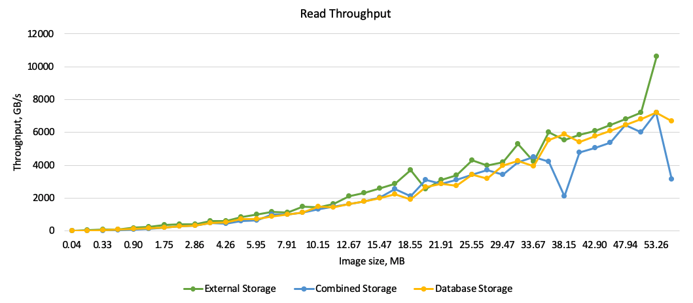
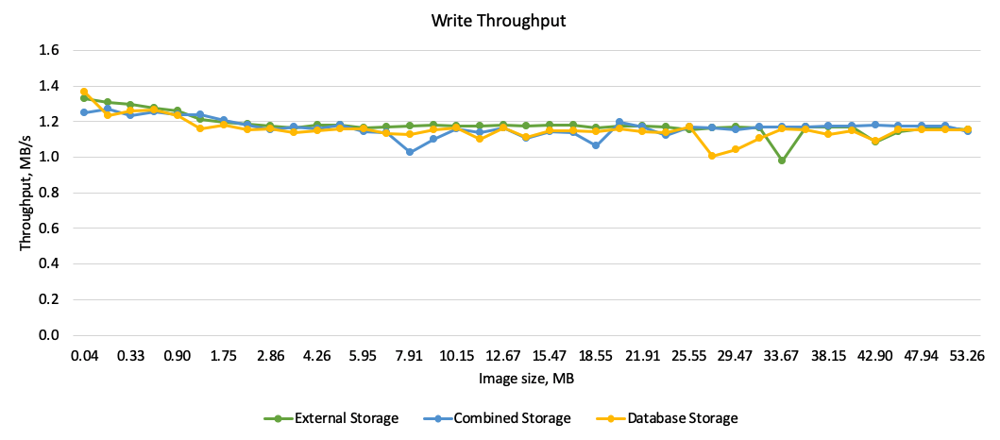

# Core Data BLOBs Benchmark

The project is created for Core Data performance research. It measure Core Data read and write throughput as performance indicator. The results summarized in blog post: http://www.vadimbulavin.com/how-to-save-images-and-videos-to-core-data-efficiently/.

    

---

    

